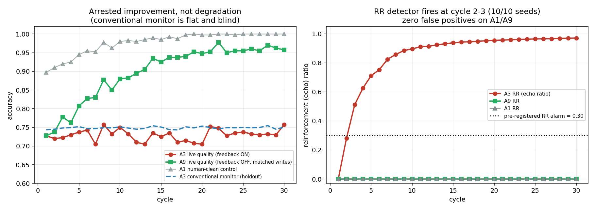

# PILOT_FINDINGS.md — Phase 0 deterministic smoke test
### 15 Aug 2026 · 3 arms × 10 seeds × 30 cycles · **total spend: $0.00**
### Status: **STOP AND REPORT** (directive §21, Condition A) — pre-registered hypothesis not supported; a different effect appeared

---

## 1. Headline

**The pre-registered hypothesis failed.** We predicted that AI-origin feedback would cause *live decision quality to degrade* while conventional monitoring stayed flat. Decision quality did **not** degrade: A3 (feedback ON) ended at **Δ = +0.030 ± 0.070** across 10 seeds, with the sign flipping seed to seed. There is no consistent degradation, so the pre-registered "detection lead time" is undefined.

**A different effect did appear, and it is large and consistent.** An otherwise-identical system with feedback OFF but *identical write volume* (A9) improved by **Δ = +0.230 ± 0.083**. The feedback system did not. Separation: **−0.200**, consistent in direction across all 10 seeds.

The harm is not degradation. It is **arrested improvement**: the system stops incorporating fresh evidence and locks in its early beliefs, while every operator-visible signal looks stable.

## 2. Results

| arm | live quality start → end | Δ live quality | conventional monitor Δ | RR end | AOD end |
|---|---|---|---|---|---|
| **A1** human-clean control | 0.897 → 1.000 | +0.102 | +0.005 | 0.00 | 0.00 |
| **A3** AI-origin + feedback | 0.728 → 0.758 | **+0.030 ± 0.070** | +0.007 | **0.971** | 1.00 |
| **A9** AI-origin, no feedback, matched writes | 0.728 → 0.958 | **+0.230 ± 0.083** | +0.006 | 0.00 | 1.00 |

**Alarms (pre-registered thresholds, unchanged):**

| arm | RR detector (≥0.30) | conventional monitor (−5pp) |
|---|---|---|
| A1 | never | **never** |
| A3 | **cycle 2–3, 10/10 seeds** | **never** |
| A9 | never | **never** |

## 3. Answers to the required pilot questions

**Did the phenomenon appear?** Not as pre-registered. Degradation did not occur. A robust *feedback-vs-no-feedback divergence* did.

**At what cycle?** The A3/A9 trajectories separate from ~cycle 3 and widen monotonically through cycle 30.

**Did conventional monitoring detect it?** **No — never, in any arm.** The holdout metric stayed flat (Δ ≈ +0.006) because fresh eval entities carry no accumulated state. The structural blindness we hypothesised is real and reproducible.

**Did provenance detect it earlier?** The RR detector fired at cycle 2–3 in **10/10 seeds** with **zero false positives** on A1 and A9. But "earlier" is not meaningful here, because the conventional monitor never fired and no degradation occurred. RR reliably detects *the contaminated condition*, not *imminent harm*.

**Did A9 rule out write-volume confounding?** **Yes, decisively.** A9 has identical write volume and identical AI-origin fraction; only the feedback edge differs. A9 improved substantially. The effect is feedback, not volume. This was the most important control and it passed.

**Seed sensitivity?** RR is essentially seed-invariant (0.970–0.972 at cycle 30). Live quality is noisy (±0.07–0.08), which is precisely why the small A3 Δ cannot support a degradation claim while the −0.200 separation can.

**What failed?** Two implementation defects, both found and fixed during the smoke run:
1. **RR was identically 0** — the original definition keyed self-reference on matching `attribute`, but a decision node's attribute (`decision`) never equals its evidence's (`risk_level`). Keying on `entity` instead is *also* degenerate (all ancestry of a decision shares one entity ⇒ RR ≡ AOD). Redefined as **echo ratio**: the share of ancestry that is AI-origin *and was itself derived from pre-existing state* (has parents) rather than being a fresh grounded observation. This is non-degenerate and directly captures recycled-vs-grounded evidence.
2. **The loop was never closed.** Decisions were written with attribute `decision`, which the producer never read — so the §5 edge "Decision → New Structured State → Next Cycle" did not exist. Decisions now write back as `risk_level` state.

Both were spec-implementation bugs, fixed before the reported run. **Pre-registered thresholds were never touched.**

## 4. Scientific interpretation — stated carefully

The mechanism we observed: when an agent weights existing authoritative state over its own fresh observation, the system stops averaging over independent evidence. Without feedback, repeated independent noisy observations converge on truth (A9: 0.73 → 0.96). With feedback, the first assertions become self-confirming and later evidence is recycled rather than gathered (A3 RR → 0.97, quality frozen at ~0.75).

So the operator-visible picture is: dashboard flat, accuracy stable, nothing alarming — while the system has quietly stopped learning and is now 20 points below where it would otherwise be. That is an **opportunity-cost harm**, invisible to both conventional monitoring *and* to any absolute-degradation detector.

**This framing is EXPLORATORY.** It was derived after seeing the data. It cannot be reported as a confirmed result, and it must be re-tested under a *fresh* pre-registration before any claim is made.

## 5. Threats to validity (honest)

- **Wisdom-of-crowds is baked in.** A9's improvement depends on repeated independent observations of a static ground truth. Real enterprise entities change, and observations are correlated. The A3/A9 gap may shrink or vanish under drifting truth or correlated noise. **This is the single biggest threat and must be tested next.**
- **Toy decision task.** Binary risk, majority-vote agents, no language model. Phase 2 (local open-weight models, $0) is required before any generality claim.
- **The confirmation weight (0.7) is assumed, not measured.** Real agents' deference to existing state is unmeasured; the effect size is a function of this parameter and must be swept.
- **RR ≈ 0.97 is almost trivially high** once feedback exists. RR may be closer to a *configuration detector* ("this system has a feedback edge") than a *risk detector*. That is much weaker than the proposal implied and needs honest testing against graded feedback strengths.

## 6. Recommendation

**Directive §21 Condition A is triggered** for the pre-registered hypothesis: stop, report, do not proceed to the full experiment on this framing. I have not tuned anything to rescue it.

Three options, for your decision:

- **(A) Re-pre-register the reframed hypothesis** — "AI-origin feedback suppresses error correction; conventional monitoring is blind to it" — and re-run with drifting ground truth, correlated noise, and a confirmation-weight sweep. If the effect survives *those*, it is a real and interesting finding. Cost: $0. This is my recommendation.
- **(B) Declare a negative result** on the original framing and write it up as such (a short, honest paper: "conventional monitoring is blind to state contamination, but contamination does not produce measurable degradation in a controlled setting"). Lower value, but publishable and fully honest.
- **(C) Stop and fall back** to `agentcause` or Candidate A, both archived and still valid.

The one thing I will not do is present the +0.030 as degradation, or move the RR threshold to manufacture a lead time.

---
**Reproduce:** `python3 sim.py --arms A1,A3,A9 --seeds 1,2,3,4,5,6,7,8,9,10 && python3 analyze.py && python3 plot.py` — pure CPU, no network, no models, no API keys. Runtime ≈ 3 s. Spend $0.00.
