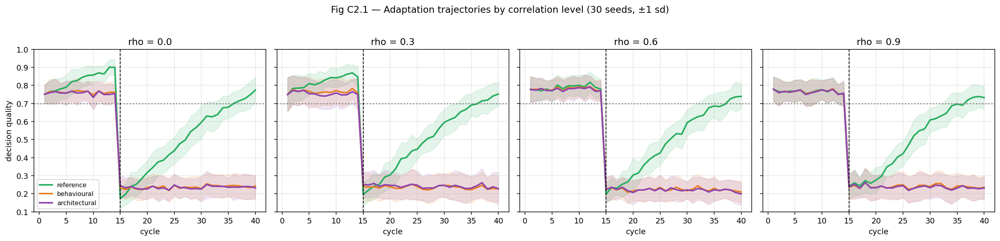

# C2_CORRELATED_NOISE_REPORT.md
### 16 Aug 2026 · run `c2_correlated_run_20260816_125534` · code `c2-correlated-1.0.0`
### 360 runs · **Cost $0.00** · runtime 18 s CPU

---

## 1. Motivation

C1 established adaptation suppression under **independent** observation noise. The manuscript names that independence assumption as its most important untested threat: the no-feedback reference recovers by accumulating repeated observations of the same entity, which is precisely what correlation would remove. C2 asks whether the C1 effect is an artifact of that assumption.

## 2. Pre-registration

Frozen in `preregistration/C2_CORRELATED_NOISE.yaml` **before** the noise model was implemented and before any C2 result was seen. `preregistration/STAGE1_CORRECTED.yaml` and all C1 raw results were left untouched. Interpretation rules (Outcome A / B / C) were declared in advance.

## 3. Noise model

**Persistent entity bias.** Each entity `e` receives one persistent error state `B_e ~ Bernoulli(p)` drawn once per seed. For each observation of `e`:

```
with probability rho    -> error = B_e            (persistent, repeats exactly)
with probability 1-rho  -> error ~ Bernoulli(p)   (fresh, independent)
```

`p = 0.25`. Marginal error rate is `rho·p + (1−rho)·p = p` **exactly for every rho**, verified numerically at all four levels. Conditions therefore differ only in dependence structure, never in overall noisiness. Correlation is attached to the entity *over time* — not across entities within a cycle — because the assumption under test is that repeated observations of the same entity are independent.

`rho ∈ {0.0, 0.3, 0.6, 0.9}`.

## 4. Conditions

Three conditions isolating the mechanism: **reference** (wb=OFF, w=0.0, no feedback), **behavioural** (wb=OFF, w=0.7, producer deference), **architectural** (wb=ON, w=0.0, readable write-back). Truth regime: abrupt shift at cycle 15, as in C1. No drift, no additional factors.

## 5. Seeds

30, paired across all conditions and rho levels.

## 6. Invariants

**All PASS.** Write-volume equality (ON == OFF at every rho and w); truth transition exactly at c15; paired seeds; marginal error rate preserved at every rho; config hash and code version on all 360 records.

**Regression check (rho = 0 must reproduce C1):**

| condition | C2 (rho=0) | C1 | diff |
|---|---|---|---|
| reference | 0.774 | 0.764 | 0.010 ✓ |
| behavioural | 0.242 | 0.237 | 0.005 ✓ |
| architectural | 0.233 | 0.237 | 0.005 ✓ |

## 7. Results

**Adaptation gap vs reference @ +25 cycles (paired, 30 seeds):**

| rho | behavioural | architectural | verdict |
|---|---|---|---|
| 0.0 | 0.532 [0.505, 0.558] | 0.542 [0.514, 0.570] | SURVIVES |
| 0.3 | 0.525 [0.488, 0.562] | 0.523 [0.478, 0.568] | SURVIVES |
| 0.6 | 0.530 [0.495, 0.565] | 0.541 [0.505, 0.576] | SURVIVES |
| 0.9 | 0.497 [0.456, 0.539] | 0.501 [0.460, 0.542] | SURVIVES |

All CIs exclude zero; **100 % of seeds same-direction** at every level; paired *d* = 4.15–7.16.

**Attenuation:** behavioural retains **94 %** of its gap at rho=0.9 (0.532 → 0.497); architectural retains **92 %** (0.542 → 0.501).

**Adaptation rates are unchanged in kind:** reference adapts 21/30, 20/30, 19/30, 20/30 across rho; every feedback condition adapts **0/30 at every rho**.



## 8. Statistics

Paired within-seed differences throughout. Effect sizes decline modestly with correlation (behavioural *d*: 7.16 → 5.06 → 5.44 → 4.34) driven by increased between-seed variance (sd 0.074 → 0.115), not by a shrinking mean gap. CIs describe simulator variability under the frozen design, not sampling error over a population of organisations.

## 9. Comparison with C1

C1 (independent noise, 30 seeds) reported gaps of 0.368–0.527 across seven conditions. C2 at rho=0 reproduces the matched subset to within 0.01. The C1 conclusions are unchanged, and no C1 number was modified.

## 10. Effect attenuation vs survival

**Outcome A — the effect survives**, per the pre-registered rule (gap ≥ 0.10 with CI excluding zero at rho=0.9). Attenuation is slight (6–8 % of the gap).

**Why it survived — and the honest caveat.** I expected persistent bias to remove the reference's recovery. It did not: the reference still reaches ~0.73 at rho=0.9. Inspection of the mechanism explains this. With `p = 0.25`, roughly 75 % of entities draw `B_e = 0` and are therefore observed *correctly* almost every time under high correlation; the remaining ~25 % are observed incorrectly almost every time. The reference recovers not by averaging independent evidence but because most entities are individually easy to read, and its ceiling is capped near 0.75 accordingly.

The consequence for interpretation is important: **C2 shows the effect is robust to observation *dependence*, but it does not test robustness to observations that are systematically *misleading about current truth*.** The feedback conditions fail at every rho because they ignore fresh evidence entirely — a harm that is indifferent to whether that evidence is independent. A sharper future test would correlate the persistent bias *with the pre-shift label*, so that stale-looking observations actively reinforce the old regime. That experiment is not run here and must not be claimed.

## 11. Threats to validity

Everything in C1 still applies (synthetic simulator, binary task, no language model, deterministic producers, abrupt total label flip, static entity population, abstract deference and write-back). C2 adds: the correlation model is synthetic and one specific form of dependence; only one truth regime was tested; the reference's high-rho ceiling is an artifact of the per-entity bias construction (§10); and the three-condition subset omits the intermediate deference levels present in C1.

## 12. Final interpretation

Under the tested range of observation correlation, feeding prior AI-generated structured state back into subsequent decisions continued to suppress recovery after a change in ground truth, with 92–94 % of the effect retained at the highest correlation level. The effect is therefore **not** an artifact of the independent-observation assumption in the specific sense tested. It remains a result about a controlled simulator, not about deployed enterprise systems.

## 13. Decision

# GO

C1 and C2 both support RQ1–RQ3; RQ4 remains a clean negative. The manuscript can now be completed with §9.7 (robustness) and a discussion bounded by §10's caveat. Remaining work is writing, reference verification, and formatting — not further experimentation, unless the sharper "misleading-observation" test in §10 is judged necessary before submission.
