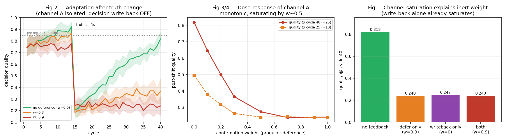

# PHASE1B_FINDINGS.md — Stage 1
### 15 Aug 2026 · code `phase1b-2.0.0` · **STOPPED FOR REVIEW** (directive §26)
### Runtime ≈ 90 s CPU total · **Cost $0.00** · no network, no models, no paid resources

---

## 1. Decision

# MODIFY

Stage 1 **as pre-registered is invalid** and its numbers must not be used. Three defects, documented below. A diagnostic ablation then revealed the mechanism *is* real and dose-dependent — but the pre-registered design could not see it, because both feedback channels were active and saturated. Stage 1 must be re-pre-registered with the two channels as explicit factors. **Stage 2 is NOT started.**

## 2. Hypothesis tested

> When downstream decisions are partially conditioned on prior AI-generated structured state, feedback reduces the system's ability to adapt to a change in underlying truth.

Primary outcome: **adaptation suppression** (not the dead Phase 0 degradation hypothesis).

## 3. Setup

100 entities, 40 cycles, batch 40, base error rate 0.25, AI-origin writes, truth modes {static, abrupt_shift @ c15}, independent noise, confirmation weight {0.3, 0.7, 0.9}, feedback {ON, OFF}, 10 seeds, paired by seed (identical truth/noise draws across arms). Provenance layer reused unchanged from Phase 0.

## 4. Defects found (this is the main Stage 1 result)

**D1 — Write-volume control C4 violated.** The decision write-back (`decision → new risk_level state`, system model §5) fired *only* when feedback was enabled. Feedback arm wrote 4800 assertions vs 3200 in the control. Your mandated matched-write control was therefore not satisfied in v1. **Fixed** in v2 (write-back now occurs in both arms; verified 4800 = 4800).

**D2 — `confirmation_weight` was completely inert.** Quality traces at w = 0.3 / 0.7 / 0.9 were *bit-identical* (0.725, 0.350, 0.175, 0.200 at cycles 14/16/25/40). Fixing D1 did not help. Root cause: the decision write-back re-injects the current majority every cycle, saturating the feedback effect regardless of producer deference. The pre-registered weight-response test could therefore never have produced a signal.

**D3 — Pre-registered adaptation-time threshold mis-calibrated.** Threshold 0.85 sustained 3 cycles was reached by **0/10 seeds in every arm**, so adaptation time was 100 % censored and uninformative. Even the best-adapting configuration only reaches ~0.818 by cycle 40. Per §10 I did **not** change the threshold; it is reported as a limitation.

**Additional invalidation:** in v1 the static-truth control (C6) showed a gap of **+0.230** versus **+0.255** for abrupt-shift. The pre-registered "adaptation gap" therefore did *not* isolate adaptation suppression from the Phase 0 arrested-improvement effect — it was measuring essentially the same thing.

## 5. Diagnostic ablation — EXPLORATORY, not pre-registered

To explain D2 I ran a 2×2 over the two feedback channels (10 seeds, abrupt shift):

| decision write-back (B) | producer deference (A) | quality @ c40 |
|---|---|---|
| OFF | OFF (w=0) | **0.818** ← system adapts |
| OFF | ON (w=0.9) | 0.240 |
| ON | OFF (w=0) | 0.247 |
| ON | ON (w=0.9) | 0.240 |

**Channel A in isolation (write-back OFF) shows the dose-response the pre-registration asked for:**

| w | 0.0 | 0.1 | 0.2 | 0.3 | 0.5 | 0.7 | 0.9 | 1.0 |
|---|---|---|---|---|---|---|---|---|
| quality @ c40 | **0.818** | 0.645 | 0.498 | 0.365 | 0.273 | 0.237 | 0.240 | 0.240 |

Monotonic, saturating around w ≈ 0.5. **Channel B alone already saturates** (0.247 at w=0), which is exactly why weight looked inert whenever write-back was on.



## 6. Interpretation — carefully bounded

Evidence-supported statements only:

1. In this simulator, **a system with no feedback edge recovers substantially after a truth change** (0.18 → 0.818 over 25 cycles), while systems with either feedback channel remain near 0.24.
2. **Producer deference produces a clean monotonic dose-response**, which is the parameter-response relationship §15 called stronger evidence than any single configuration.
3. **Decision write-back is the dominant channel** — sufficient on its own to fully suppress adaptation. This maps directly to your CRM example ("Risk Agent recommends enhanced review → CRM receives new evidence").
4. **The pre-registered Stage 1 could not detect any of this**, because it never separated the two channels.

What I am **not** claiming: that this generalises beyond a binary-label majority-vote simulator with independent noise and static entity population; that RR is a risk detector rather than a configuration detector; or that the exploratory ablation is confirmatory. It is not — it was run after seeing the failure.

## 7. Threats to validity

- **Synthetic environment.** Binary risk labels, majority-vote agents, no language model. Nothing here is evidence about real agents yet.
- **Observation assumptions.** Independent noise only; correlated noise (Stage 2) is implemented but untested. The wisdom-of-crowds recovery in the no-feedback arm depends on independence and will likely weaken under correlation — still the biggest threat.
- **Ground-truth process.** A total label flip for all entities is an extreme regime change; gradual drift is implemented but untested.
- **Feedback implementation.** Two channels exist and interact by saturation; the "feedback ON/OFF" factor in the pre-registration conflated them.
- **Parameter sensitivity.** The effect saturates by w ≈ 0.5, so any configuration with w ≥ 0.5 *or* write-back enabled looks identical. Real-system deference is unmeasured.
- **Adaptation threshold.** 0.85 was unreachable; the metric produced no information.

## 8. What Stage 1 must become before re-running

Re-pre-registration required, with:
- **Factor A** producer deference weight (0.0 … 1.0) and **Factor B** decision write-back (on/off) as **orthogonal, explicit** factors — not a single "feedback" flag.
- **Recalibrated adaptation threshold**, chosen from the *no-feedback* arm's achievable ceiling (~0.82), e.g. 0.70 sustained 3 cycles — declared before treatment runs.
- **Static-truth control reported alongside every abrupt-shift condition**, so adaptation suppression is separated from arrested improvement by construction.
- 30+ seeds for any condition that will be claimed.

## 9. Reproduce

```
cd pilot/phase1b
python3 sim1b.py --seeds 10 --out results/raw/stage1_v2.json
python3 analyze1b.py
python3 plot1b.py
```
Pure CPU, deterministic, seeded. `results/raw/stage1_INVALID_v1.json` is retained unmodified as the record of the defective run — raw results are never overwritten.

## 10. Awaiting Cowork/researcher review

Per §26 I stopped rather than continuing into Stage 2. Recommended next action: approve the re-pre-registration in §8, then re-run Stage 1 properly. Estimated cost: **$0.00**.
